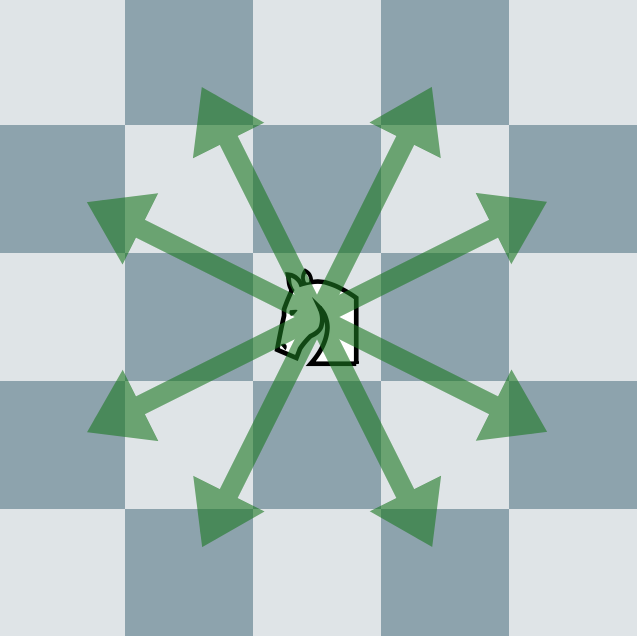

# ナイト

実行時間制限: 1 sec / メモリ制限: 256 MB  

## 問題文

\\(N \times N\\)のチェス盤があります.  
任意の位置からスタートし, ナイトで全てのマスに到達しきるための最小手数を求めてください.  
同じマスは何度通っても構いません.  
  
ナイトが一手で移動できるマスは以下のようになっています.  
  
形式的には, \\((x,y)\\)にナイトがいるときに一手で移動できるマスは,\\((x+1,y+2),(x+2,y+1),(x+2,y-1),(x+1,y-2),(x-1,y-2),(x-2,y-1),(x-2,y+1),(x-1,y+2)\\)の八箇所のうち, チェス盤の範囲内のマスとなります.  

## 入力

入力は以下の形式で標準入力から与えられます.  
  
\\(
N \\
\\)
  
- \\(1\\)行目に\\(N\\)が与えられます.

### 制約

\\(
1 \leq N \leq 10 \\
\\)

## 出力

標準出力に, 必要な最小手数を\\(1\\)行で出力してください.  
全てのマスに到達することが不可能な場合は-1を出力してください.  
出力の末尾には改行を入れてください.  

---

### 入力例1

```
8

```

### 出力例1

```
63

```

一般的なチェス盤では\\(63\\)手で全てのマスに到達することができます.  

---

### 入力例2

```
1

```

### 出力例2

```
0

```

始めの位置から移動する必要がないので最小手数は\\(0\\)です.  
