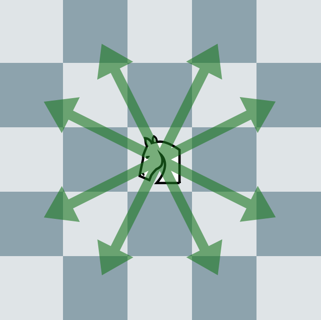

# ナイト再び

実行時間制限: 2 sec / メモリ制限: 256 MB  

## 問題文

\\(N \times N\\)のチェス盤があります.  
左から\\(x(0 \leq x \leq N-1)\\)番目, 下から\\(y(0 \leq y \leq N-1)\\)番目のマスを\\((x,y)\\)とします.  
マス\\((s_x,s_y)\\)からスタートし, ナイトが\\(M\\)手でマス\\((t_x,t_y)\\)に丁度到達するような経路数を求めてください.  
同じマスは何度通っても構いません.  
このような経路数は非常に大きな値を取り得るので, \\(1,000,000,007\\)で割った余りを解として出力してください.  
  
ナイトが一手で移動できるマスは以下のようになっています.  
  
形式的には, \\((x,y)\\)にナイトがいるときに一手で移動できるマスは,\\((x+1,y+2),(x+2,y+1),(x+2,y-1),(x+1,y-2),(x-1,y-2),(x-2,y-1),(x-2,y+1),(x-1,y+2)\\)の八箇所のうち, チェス盤の範囲内のマスとなります.  

## 入力

入力は以下の形式で標準入力から与えられます.  

\\(
N\ M \\
s_x\ s_y \\
t_x\ t_y \\
\\)

- \\(1\\)行目に\\(N\\)と\\(M\\)が空白区切りで与えられます. 
- \\(2\\)行目にスタートするマス\\(s_x\\)と\\(s_y\\)が空白区切りで与えられます.  
- \\(3\\)行目に目標のマス\\(t_x\\)と\\(t_y\\)が空白区切りで与えられます.  


### 制約

\\(
1 \leq N \leq 10 \\
1 \leq M \leq 10^4 \\
0 \leq s_x,s_y,t_x,t_y \leq N-1 \\
\\)

## 出力

標準出力に, \\(s_x, s_y\\)から\\(t_x, t_y\\)に\\(M\\)手で丁度到達するような経路数を\\(1,000,000,007\\)で割った余り出力してください.  
出力の末尾には改行を入れてください.  

---

### 入力例1

```
3 2
0 0
0 0

```

### 出力例1

```
2

```

---

### 入力例2

```
5 4
0 2
1 3

```

### 出力例2

```
23

```