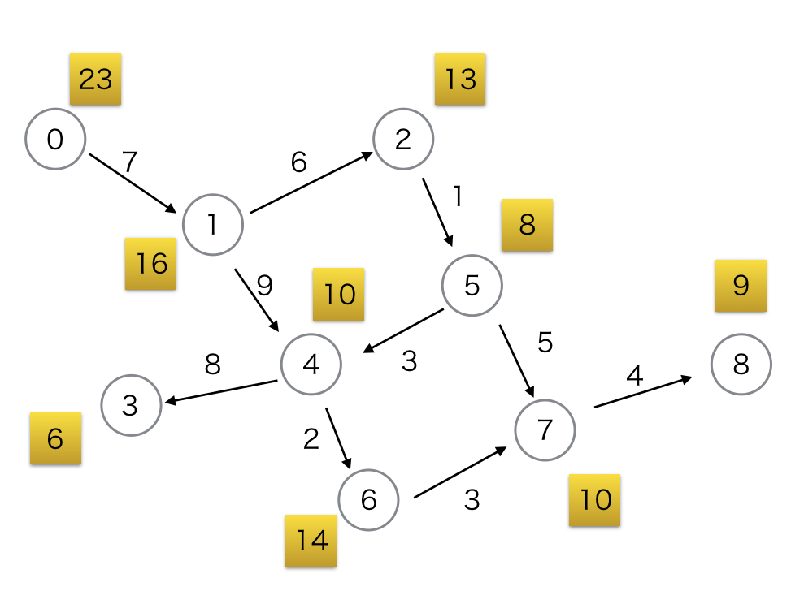

# 気まぐれ勇者

実行時間制限: 2 sec / メモリ制限: 256 MB  

## 問題文

この世界には\\(N\\)個の国が存在して, \\(0\\)から\\(N-1\\)までの番号で呼ばれています.  
国と国を繋ぐ道は\\(M\\)本あり, 国\\(s_i\\)と国\\(t_i\\)を繋ぐ道の距離は\\(d_i\\)であることがわかっています.  
また, 国同士の決まりでどの道も一方通行しかできないようになっています. 
ある国を出て同じ国にそのまま入ってくるような道や, ある国と他のある国を繋ぐ同方向の道は存在しません.   

そんな世界のある国に, とても気が変わりやすい勇者がいました.  
王様から魔王を倒してこいとの言いつけを受けたので旅にでないといけないのですが, 内心では面倒くさいなと思っていたところでした.  

しかしこれでも勇者の端くれなので, 国民には尊敬と期待の眼差しを向けられています.  
このような扱いを受けるのは結構気分の良いもので, そんな時には魔王を倒しに行ってやってもいいかなという気になるのでした.  

結局, 勇者は今いる国\\(S\\)から, 魔王が拠点としている国\\(T\\)へ旅をすることになりました.  
勇者がある国\\(i\\)にいるとき, その国の国民の声援によって勇者のやる気は\\(V_i\\)になります.  
勇者が国\\(i\\)を出る時, "やる気を保てる経路"の総距離が\\(V_i\\)より大きい場合は, やる気がもたないので通るのをやめます.  
ここで, "やる気を保てる経路"とは国\\(i\\)から国\\(T\\)への経路のうち, 通過するどの国でも上記の方法で通る経路を限定していったときに, \\(T\\)に辿り着けるような経路のことを指します.  
"やる気を保てる経路"の総距離とは, そのような経路に含まれる道の総距離のことです.  
詳しくはサンプルケースを確認してください.  

勇者が魔王のいる国へ辿り着けるような経路が存在するかどうかを判定してくだい.  

## 入力

入力は以下の形式で標準入力から与えられます.  

\\(
N\ M \\
V_0 \\
\vdots \\
V_i \\
\vdots \\
V_{N-1} \\
s_0\ t_0\ d_0 \\
\vdots \\
s_i\ t_i\ d_i \\
\vdots \\
s_{M-1}\ t_{M-1}\ d_{M-1} \\
S\ T \\
\\)

- \\(1\\)行目に\\(N\\)と\\(M\\)が空白区切りで与えられます.
- \\(2\\)行目からの\\(N\\)行に\\(V_i\\)が与えられます.
- \\(N+2\\)行目からの\\(M\\)行に\\(s_i,t_i,d_i\\)が空白区切りで与えられます.
- 最後の行に\\(S\\)と\\(T\\)が空白区切りで与えられます.

### 制約

\\(
1 \leq N \leq 100 \\
1 \leq M \leq \frac{N(N-1)}{2} \\
1 \leq V_i, d_i \leq 100 \\
\\)

## 出力

標準出力に, \\(S\\)から\\(T\\)へ辿り着けるような経路が存在するとき"YES",そうでないとき"NO"を\\(1\\)行で出力してください.  
出力の末尾には改行を入れてください.  


---

### 入力例1

```
9 10
23
16
13
6
10
8
14
10
9
0 1 7
1 2 6
1 4 9
4 3 8
4 6 2
5 7 5
7 8 4
5 4 3
6 7 3
2 5 1
0 8


```

### 出力例1

```
NO

```




勇者のいる国はとりあえず置いておいて, \\(5 \to 7 \to 8\\)という経路を考えてみましょう.  
道の総距離が\\(9\\)で国\\(5\\)の声援が\\(8\\)なので, 国\\(5\\)を出る時点でその先の総距離が国\\(8\\)の声援より大きく, \\(5 \to 7 \to 8\\)は"やる気を保てる経路"ではないことがわかります.  
  
では, \\(5 \to 4 \to 6 \to 7 \to 8\\)という経路を考えてみましょう.  
道の総距離が\\(12\\)で国\\(5\\)の声援が\\(8\\)なので, この経路も"やる気を保てる経路"ではないことがわかります.  
  
また, \\(5 \to 4 \to 3\\)という経路はそもそもその先に魔王のいる国へと続く経路が存在しないので正しい経路ではありません.  
  
国\\(5\\)を通る経路はどれも"やる気を保てる経路"でないことがわかるので, 国\\(5\\)へ来た時点で"やる気を保てる経路"として正しくなかったことがわかります.  
  
次に, \\(1 \to 4 \to 6 \to 7 \to 8\\)という経路を考えてみましょう.  
道の総距離が国\\(1\\)の声援より大きいことがわかるので,"やる気を保てる経路"ではありません.  
\\(1 \to 4 \to 3 \\)は魔王のいる国へたどり着けないので,正しい経路ではありません.  
  
また, 前の議論から国\\(5\\)を通る経路は"やる気を保てる経路"ではないことがわかったので\\(1 \to 2 \to 5 \cdots \\)は距離を考慮せずとも"やる気を保てる経路"として成立していません.  


よって, 国\\(1\\)へ来た時点で"やる気を保てる経路"として正しくなかったことがわかります.
勇者のいる国\\(0\\)からは国\\(1\\)へしか行けないのでその先に"やる気を保てる経路"が存在しないことがわかります.  
勇者は国を出れないので答えは"NO"です.  